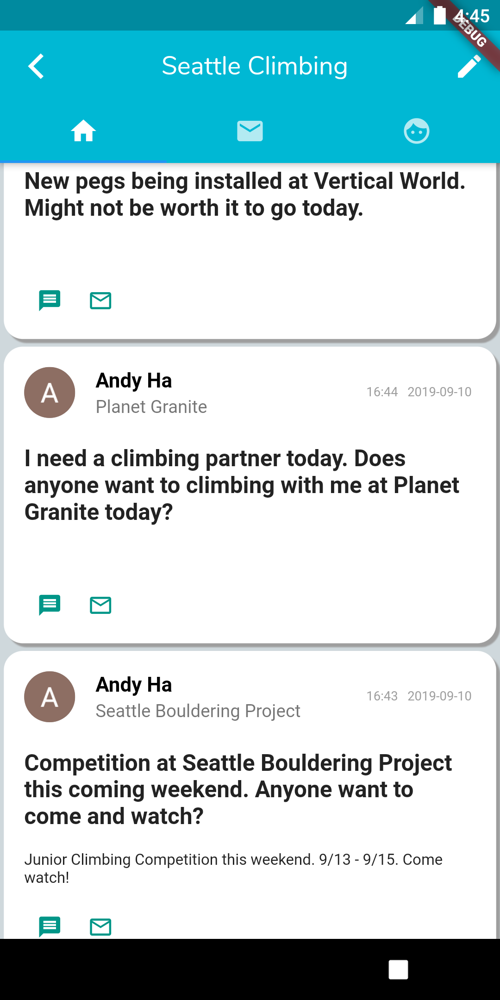
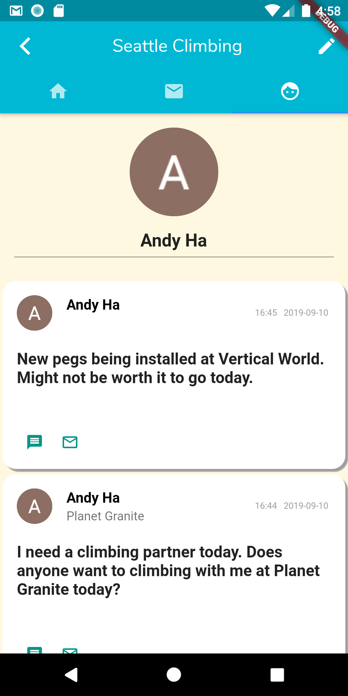
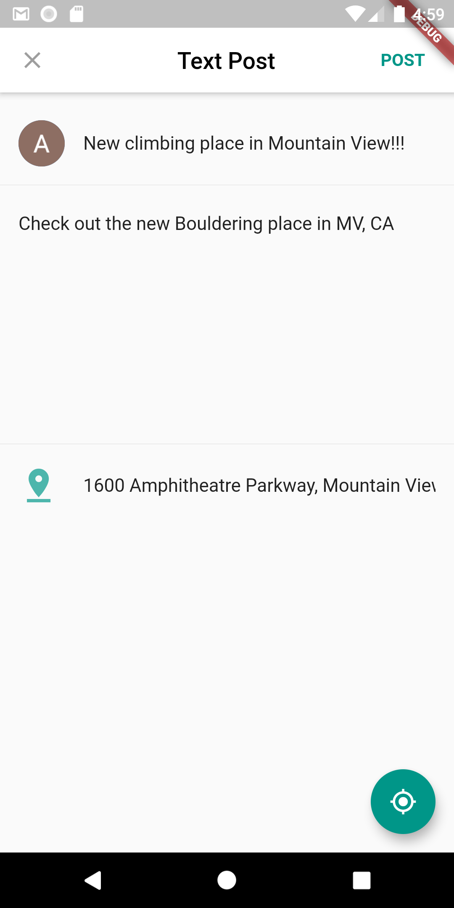

# Seattle-Climbing
 
 by Thien-An Andy Ha
 
 
 This project is used for rockclimbers in Seattle. 
 Uses a social media and messaging function within the app to connect with other climbers.
 Used Flutter, Dart, and Firebase to achieve this. 
 
 

This is the Log in screen. Users can log in using their google account.

This is what the feed looks like. This uses Firebase to store all the posts. Also uses User's Google account 
to access Profile picture and name.

This is the Profile page. Also uses User's Google account 
to access Profile picture and name.

This is when a User wants to create a new Post.
Uses location settings to located where device is. 
